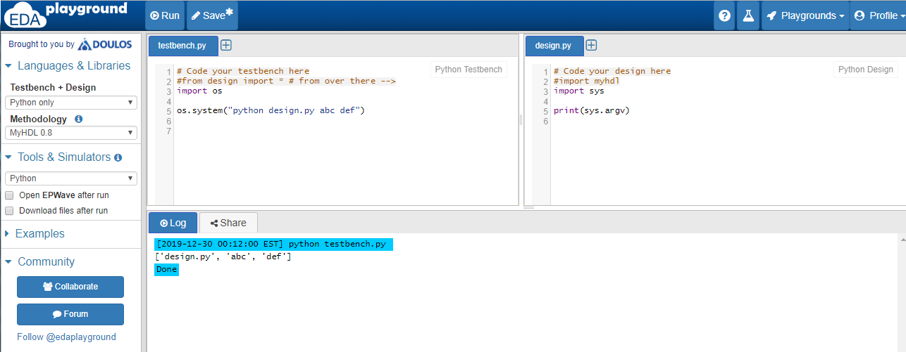
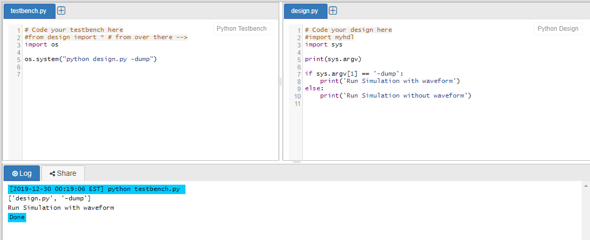
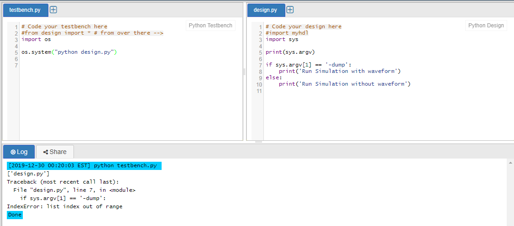
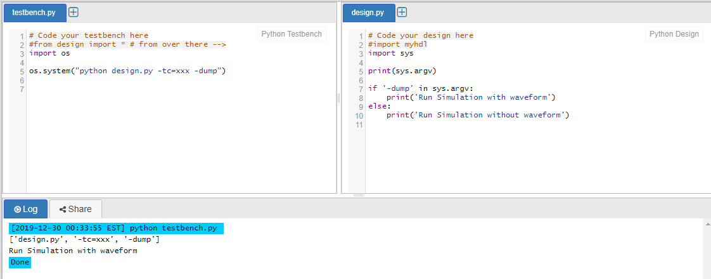

# sys.argv

在sys库里，argv列表保存着命令行转进来的参数。第一个参数是脚本自身的文件名，从第二个参数开始是实际参数。

所以可以简单的用`sys.argv[1] == '-dump'`来判断。

但如果参数不存在，就会报错。提示列表超出范围。

我们可以先判断参数的个数`len(sys.argv)`来避免这个错误。

另一种方法是用`if '-dump' in sys.argv`来判断参数是否存在。这种方法的好处是参数顺序可以是任意的。

